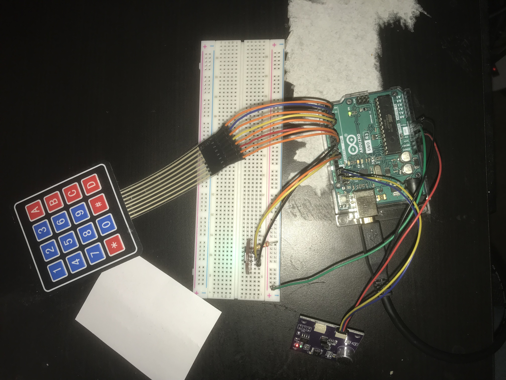
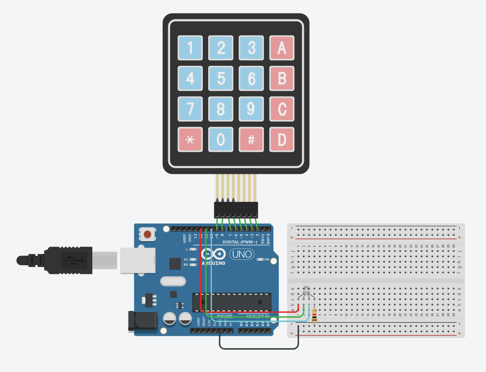

# Arduino Noise Level Sensor

Jason Warta

Class: CS241 - Computer Hardware Concepts - Spring 2021  
Instructor: Dr. Lawlor

CS F241 Final Project  
Arduino Noise level detector

## Hardware

- Arduino Uno
- K851264 LED RGB (from lab kit)
- SEN-15892 Zio Qwiic Loudness Sensor
- 4x4 Keypad
- breadboard
- Assorted jumpers
- Qwiic -> jumper adapter

## Purpose

This software allows a user to configure noise gates,
and show a different colored indicator (green, yellow, or red)
to indicate if the noise level in a room is too high.

The intended purpose was for a grade-school teacher to use
to indicate that students need to quiet down.

The software holds four thresholds in memory to set the color of the light.

By default, these are:

- 300 - 500: green
- 500 - 700: yellow
- 700 - 900: red

Configuration steps to change the thresholds:

1. Press '#' on the keypad. This puts the device in listening mode.
2. Enter a multidigit number by pressing the desired keys.
3. When you have finished entering the number, press '\*'.
4. Repeat steps 2-3 for two more numbers.
5. Repeat step 2 for a fourth number, but press '#' to finish the sequence.
6. The light will cycle through the 3 colors a few times to indicate that _something_ happened.

## Additional Details

- [QWIIC configuration](app/app.ino#L47)
  - for simplicity, this is wired to the SDA and SCL pins on the Arduino
- [Keypad Pinout](app/app.ino#L60)
- [RGB LED pinout](app/app.ino#L81)
- [Color presets](app/app.ino#L96)

## Functional Circuit

## Tinkercad Diagram

Zio QWIIC loudness sensor not included, because it doesn't exist in tinkercad.

